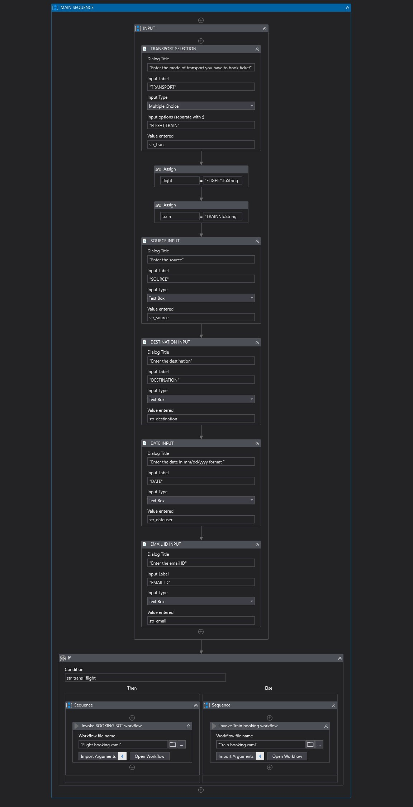

# Ticket Booking Bot using RPA


[](LICENSE)

## Overview
This project aims to automate booking tickets on various websites for trains and flights. Despite the plethora of ticket booking websites available, finding the best one that fits the user's budget and quality preferences can be challenging. The Ticket Booking Bot, developed using Robotic Process Automation (RPA), automates this process using user inputs to find the best website based on budget and quality and then books the tickets on that site. This bot also reduces users' time and effort to find and book tickets. The chatbot component uses keywords to understand user requests and initiate the booking process. The project utilizes UiPath Studio and UiPath Orchestrator to achieve automation.



## Table of Contents
- [Features](#features)
- [Installation](#installation)
- [Usage](#usage)
- [Technologies Used](#technologies-used)
- [Contributing](#contributing)
- [License](#license)
- [Contact](#contact)

## Features
- Automated login and authentication
- Real-time ticket availability check across multiple websites
- Budget and quality-based sorting of websites
- Automated booking confirmation and email notification
- Error handling and retry mechanism
- User-friendly chatbot interface for configuration and booking

## Installation

### Prerequisites
- UiPath Studio
- UiPath Orchestrator
- SMTP server for email notifications

### Steps
1. Clone the repository:
    ```bash
    git clone https://github.com/Haritha-Sivasankaran/Ticket_Booking_Bot.git
    cd Ticket-Booking-Bot
    ```

2. Open the project in UiPath Studio and publish it to UiPath Orchestrator.

3. Configure the bot settings in UiPath Orchestrator, including the SMTP settings for email notifications.

4. Run the bot through the UiPath Orchestrator.

## Usage

1. **Configuration:** Update the bot settings in UiPath Orchestrator with your credentials and preferences.
    ```yaml
    username: "your_username"
    password: "your_password"
    booking_details:
      transport_type: "flight"
      departure_city: "New York"
      arrival_city: "Los Angeles"
      date: "2024-07-01"
      budget: 300
    ```

2. **Execution:** Run the bot using UiPath Orchestrator.

3. **Output:** The bot will log the process in UiPath Orchestrator and send a confirmation email upon successful booking.

### Sample Output

Here are some sample outputs from the bot:

- **Choosing Between Options**
  
  

- **Inputs**
  
  
  

- **Sorted Tickets sent to email**
  
  
   
## Technologies Used
- **UiPath Studio**: For designing automation workflows
- **UiPath Orchestrator**: For managing and scheduling bots
- **SMTP**: For sending email notifications

## Contributing

We welcome contributions! Please follow these steps:

1. Fork the repository.
2. Create a new branch (`git checkout -b feature-branch`).
3. Make your changes.
4. Commit your changes (`git commit -m 'Add some feature'`).
5. Push to the branch (`git push origin feature-branch`).
6. Create a pull request.

Please ensure your code follows our coding standards and includes appropriate tests.

## License
This project is licensed under the MIT License - see the [LICENSE](LICENSE) file for details.

## Contact
Created by [Haritha Sivasankaran](https://github.com/Haritha-Sivasankaran) - feel free to contact me at harithasivasankaran28@gmail.com.
